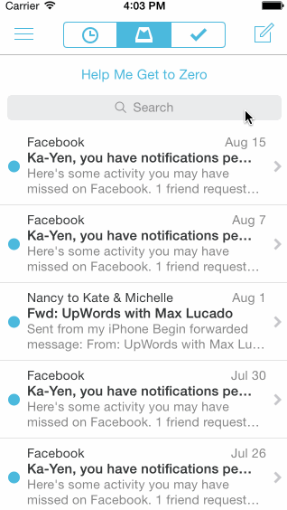

CodePath Week 3 Homework - Mailbox Prototype
============================================

Mailbox message swipe animation, menu show & hide animation, compose and undo

#### All required stories ####
* Swipe message left with reschedule and list
* Swipe message right with archive and delete

#### All option stories ####
* Panning from edge to reveal menu
* Tag on compose to reveal compose view
* Shake to undo

#### Additional stories ####
* Show cancel compose options in Action Sheet

GIF created with [LICEcap](http://licecap.en.softonic.com/ "Download LICEcap").
